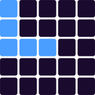
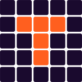
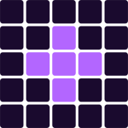

_A plain-English walkthrough of how the game works, how the economy moves, and what lives under the hood. Meant to get anyone joining the team up to speed in one read._

_Last updated: 2026-04-24_

---

## In one minute

VibeMatch is a match-3 puzzle where the tiles are collectible Good Vibes Club pin artwork. You play short 30-move runs, score points, and at certain score thresholds you earn **Pin Capsules**. Rip them open to reveal a random pin from a 101-pin catalog spread across five rarity tiers.

The core loop is free-to-play and skill-driven: play → score → earn capsules → open → grow your collection → climb the Collector Tier ladder. A crypto token (**$VIBESTR**) sits on the premium edge of the economy: players who want more than the daily free allotment can burn VIBESTR to unlock bonus prize runs or reroll duplicate pins into fresh capsules. Every non-paid surface: daily challenge, leaderboards, achievements, tier progression: stays free.

Pins are **in-game collectibles only**. They aren't NFTs, aren't tradable, don't carry monetary value, and never leave the app. They exist to be collected, displayed, and chased.

---

## Table of contents

1. [The core loop](#1-the-core-loop)
2. [Gameplay mechanics](#2-gameplay-mechanics)
3. [Game modes](#3-game-modes)
4. [Pin collection](#4-pin-collection)
5. [Collector Tiers](#5-collector-tiers)
6. [The capsule economy](#6-the-capsule-economy)
7. [The Daily Challenge](#7-the-daily-challenge)
8. [Achievements (Quests)](#8-achievements-quests)
9. [Leaderboards](#9-leaderboards)
10. [Streaks & referrals](#10-streaks--referrals)
11. [$VIBESTR: the only paid lever](#11-vibestr--the-only-paid-lever)
12. [Anti-abuse systems](#12-anti-abuse-systems)
13. [Where players see what](#13-where-players-see-what-ux-surfaces)
14. [Tech stack](#14-tech-stack)

---

## 1. The core loop

```
    ┌─────────────────────────────────────────┐
    │                                         │
    ▼                                         │
 Play Classic ──► Score 15K+ ──► Earn Capsule ├──► Open Capsule ──► Get Pin
    │                                         │         │
    │                                         │         │
    ▼                                         │         ▼
 Use a free prize play                        │   Grow collection %
 (10/day base + bonus)                        │         │
                                              │         ▼
                                              │   Climb Collector Tier
                                              │         │
                                              │         ▼
                                              └── Unlock Achievements ──► More capsules
```

The whole thing runs on "I want one more pin." Players play, score, earn, open, and chase the next tier. Most surfaces in the app exist to make progress legible: progress bars on quests, nearest-to-unlock achievements in the left rail, "you're #3 on the Pins leaderboard" signals. The collection never feels static.

---

## 2. Gameplay mechanics

The board is **8×8**. Each tile is a **badge** (pin artwork) drawn from a per-game pool of ~12 badge identities. Swap adjacent tiles to line up 3+ same-pin matches: they clear, tiles above fall down, new tiles spawn.

### Score inputs

- **Match length**: a 3-match is the base, 4-match pays more, 5+ pays a lot more.
- **Combos**: chain multiple moves without idle time and the multiplier climbs.
- **Cascades**: when cleared tiles trigger new matches on fall, each subsequent match increases the cascade multiplier.
- **Shape bonuses**: certain geometries trigger heavy multipliers when two matching lines share a tile. Shapes are detected from cascade resolution, not planned with a single swap.

|  |  |  |
|:---:|:---:|:---:|
| **L-Shape · x1.5** | **T-Shape · x2.5** | **Cross · x4** |
| Two lines meet at a corner | Line meets the middle of another. Earns a bonus capsule. | Two lines cross at the middles. Earns a bonus capsule. |

### Specials (auto-generated)

Bigger matches create powerful special tiles that detonate on their next swap:

- **4-match** → Bomb (clears a 3×3 area)
- **5-match** → Laser Party (lightning strike clearing a row + column)
- **6+ match or cosmic-tier 5-match** → Cosmic Blast (large cross-shaped clear)

### Move budget

**30 moves.** When you hit 0, the game ends. There's no time limit per move: puzzle mode, not action. A soft hint highlights a valid swap after 8 seconds of idle (once per game).

---

## 3. Game modes

### Classic VibeMatch

The workhorse. 30-move run with a freshly randomized board each time. This is where most capsule earning happens. Each player gets **10 prize-eligible plays per day** (more with purchased bonuses: see §11). Additional plays are "extra plays": still playable for fun, but they don't count for capsules or leaderboards.

### Daily Challenge

One attempt per day per player. **Same seeded board for everyone**, so the daily leaderboard is a pure skill comparison on an identical puzzle. Top finisher each day receives **+10 Pin Capsules** the next time they load the app.

The Daily is a separate leaderboard from Classic, resets at UTC midnight, and runs on its own atomic markers so the refresh-the-page-for-a-new-board exploit doesn't work.

---

## 4. Pin collection

The full catalog is **101 unique pins** spread across 5 rarity tiers:

| Tier | Name (display) | Unique pins | Color |
|---|---|---:|---|
| `blue` | Common | 19 | Grey |
| `silver` | Rare | 51 | Blue |
| `special` | Strategic Special | 9 | Orange |
| `gold` | Legendary | 19 | Gold |
| `cosmic` | Cosmic | 3 | Purple |

Every capsule opens into a random pin: tier first (weighted by rarity), then a specific pin from that tier (the Special tier internally biases toward rarer VIBESTR-themed variants via per-badge `dropWeight`).

Duplicates happen and they're useful: they feed the reroll flow (§11) and they count toward **lifetime tier-find achievements** that reward quantity rather than uniqueness.

---

## 5. Collector Tiers

Separate from rarity-of-pins: this is the **player's status tier**, derived from their overall collection %:

| Tier | Label | Threshold |
|---|---|---:|
| 1 | **Plastic** | 0 % |
| 2 | **Grailscale** | 10 % (11+ pins) |
| 3 | **Collectooor** | 25 % (26+ pins) |
| 4 | **69K Gold** | 50 % (51+ pins) |
| 5 | **Shadow Funk** | 75 % (76+ pins) |
| 6 | **Cosmic** | 90 % (91+ pins): purple nebula treatment |
| 7 | **One-Of-One** | 100 % (101 pins): holographic foil treatment |

Surfaced on the desktop profile pill (tap it to open the **Collector Tiers modal** which lists every band with thresholds and flags the player's current tier). The Cosmic and One-Of-One tiers get animated visual treatments in the modal: purple nebula + particles on Cosmic, rainbow holographic sweep on One-Of-One.

---

## 6. The capsule economy

### How you earn a capsule

Three conditions must hold:

1. Score **≥ 15,000** in a Classic game, OR finish any Daily Challenge with a valid score.
2. The match is **prize-eligible** (not capped, not abandoned: see §12).
3. Server validates the match token you were issued at game start.

### Tiered capsule payout (Classic)

| Your score | Capsules awarded |
|---|---:|
| 15,000 – 29,999 | 1 |
| 30,000 – 49,999 | 2 |
| 50,000+ | 3 |

Daily Challenge doubles these numbers (2 / 4 / 6) to compensate for the one-shot-per-day format.

### Bonus capsule

Landing a **T** or **Cross** shape during a game earns **+1 bonus capsule** on top of the score-tier payout. Capped at one bonus per match. Requires the match to still be prize-eligible.

### Daily Champion

Yesterday's #1 player on the Daily Challenge leaderboard is credited **+10 Pin Capsules** on their first session load the next day. The claim is idempotent per day so tabs can't double-claim.

### Opening a capsule

Tap OPEN on the capsule card → server rolls the tier (weighted), picks a specific badge from that tier (also weighted within Special), and stores the pending reveal for 5 minutes. The player sees the 3D capsule crack animation, the pin reveals, and they collect it. The pin goes into their pinbook: duplicate? Increment count. New? Add with a first-earned timestamp.

Every collect also bumps a **lifetime counter** for that pin's tier. That counter is the authoritative number for the "Find N pins of tier X" achievements and never decrements: even if the pin is later rerolled away.

### Rerolling duplicates

Sitting on duplicate pins? Burn them back into fresh capsules via the Reroll flow. Burn cost per fresh capsule, by tier:

| Tier | Dupes burned per capsule |
|---|---:|
| Common | 5 |
| Rare | 4 |
| Special | 3 |
| Legendary | 2 |
| Cosmic | 1 |

Plus **1 VIBESTR per capsule** as a flat protocol fee. The player always keeps at least one of each unique pin they own: reroll never consumes their last copy.

---

## 7. The Daily Challenge

### What makes it special

- **Same board for everyone, globally.** The seed is deterministic by date, so if you and I both play on 2026-04-24, we're staring at identical tile layouts.
- **One attempt per day, ever.** Can't refresh to reroll the board: the `daily_played` marker is set atomically the moment you start, and the game server refuses to let you start again until midnight UTC.
- **Its own leaderboard** that resets daily at UTC midnight. Top finisher gets the 10-capsule prize.

### On the landing page

The right rail has a dedicated **DAILY CHALLENGE** box showing:

- **RANK TODAY**: your rank on today's board (`#12` etc.) or a dash if you haven't played
- **YOUR SCORE**: your daily score
- **TOP SCORE**: the current leader's score
- **10× capsule prize hover pill** next to the header, explaining the Daily Champion bonus
- **ENTER CHALLENGE** button (or "You've already played today" if played)
- **VIEW LEADERS** pill that opens the leaderboard modal straight on the Daily tab

If you're currently #1, the whole box flips to gold: a "#1 TODAY" crown pill floats above, the bezel pulses gold, and the RANK tile switches from purple to gold. Hard to miss.

---

## 8. Achievements (Quests)

Two categories. Every achievement is **sticky** (once unlocked, always unlocked) and each awards 1 to 5 capsules on unlock.

### Journey (18 quests)

First-time-user-experience beats that teach the mechanics. Play your first game, create your first bomb, land your first T-shape, reach a 3-day streak, etc. Designed to give new players a reliable trail of small wins in their first few sessions.

### Mastery (37 quests)

Long-term goals for experienced players. Big buckets:

- **Combo ladders**: 5× / 6× / 8×
- **Unique pin milestones**: 10 / 25 / 50 / 69 / 90 / all 101
- **Complete tier sets**: all 19 Commons, all 51 Rares, all 9 Specials, all 19 Legendaries, all 3 Cosmics
- **Lifetime tier finds** (duplicates count, rerolls don't regress):
  - Common Currency: find 200+ Commons total
  - Rare Air: find 100+ Rares
  - Special Operations: find 25+ Specials
  - Legend in the Making: find 50+ Legendaries
  - Cosmic Frequency: find 10+ Cosmics
- **Gameplay milestones**: 5 bombs in a game, cascades of 15 / 30 / 45, shape counts, shape trifecta (L + T + cross in one game)
- **Score thresholds**: 50K (Score Legend), 69K (Diamond Hands), 85K (Hall of Vibes)
- **Streaks**: 7 and 30 days
- **Daily**: score 30K / 50K / win as champ
- **Social**: refer 1 / 5 / 10 friends
- **Wallet**: first prize-game purchase, connect a VIBESTR-holding wallet

### Quest progress & rotation

Every achievement with a numeric target exposes a progress value (current / target / %). Two places surface it:

- **Desktop QUESTS rail**: rotates 3 random progressable quests per session from the unlocked-eligible pool, with progress bars. The shuffle is mount-stable (re-renders don't re-shuffle) so it stays coherent across the visit.
- **Full Quests modal**: shows all 55+ achievements grouped by category. Progressable ones display a current/target counter + % + cosmic-gradient progress bar inline. Completed ones show a gold check badge; the bar disappears.

---

## 9. Leaderboards

Four boards, one modal, four tabs:

| Tab | What it shows | Reset cadence |
|---|---|---|
| **All-Time (Classic)** | Top classic scores ever recorded | Never |
| **Weekly** | Top scores for the current week | Monday 00:00 UTC |
| **Daily** | Top Daily Challenge scores for today | 00:00 UTC daily |
| **Pins** | Top pin collectors by % complete | Updated on every new pin collected |

Classic scores only count if the match was prize-eligible (see §12). Extra-play scores (runs beyond the daily prize cap) are intentionally excluded from All-Time and Weekly, so the leaderboard reflects "best of 10 tries per day" rather than "who has the most time to grind".

The desktop profile block exposes **PIN RANK** and **SCORE RANK** as tappable tiles that open the leaderboard modal directly on the relevant tab.

---

## 10. Streaks & referrals

### Streaks

Consecutive days played. A game end in Classic OR Daily bumps the counter for today. If yesterday was blank, the streak resets to 1. Milestones unlock achievements at 3, 7, and 30 days. Shown on the desktop profile as **DAY STREAK**.

### Referrals

Every player has a referral URL in the form `https://vibematch.app?ref=<username>`. When someone signs up via that link:

- **Referrer gets +2 capsules**
- **New user gets +2 capsules**

Lifetime cap: 50 capsules earned from referrals per account. Drives the `refer_1`, `refer_5`, `refer_10` achievements.

---

## 11. $VIBESTR: the only paid lever

$VIBESTR is the crypto token used for premium, skill-scaling purchases. **Everything players can earn through play stays free.** VIBESTR only buys convenience:

| Flow | Cost | Player gets |
|---|---|---|
| **Buy Prize Games** | Variable (pack pricing in the Prize Shop) | +N bonus plays on today's daily cap, which is the only way to earn capsules beyond the free 10/day |
| **Reroll** | 1 VIBESTR per capsule + dupe burn per tier | +1 Pin Capsule, generated from burned duplicates |

Both flows are non-custodial: the user signs a transaction against the VIBESTR contract from their own wallet (via RainbowKit / Wagmi). VibeMatch never holds user crypto.

### What VIBESTR *doesn't* buy

Everything else:

- Earning capsules from gameplay: free
- Daily Challenge entry and the Champion bonus: free
- Unlocking achievements: free
- Climbing the leaderboards: free
- Tier progression: free
- Avatar and username changes: free
- Opening capsules: free (you earned the capsule; opening it is just a click)

### Wallet signals

Connecting a wallet that holds any VIBESTR balance triggers the `wallet_vibestr` achievement (+2 capsules). Server verifies the balance against the token contract before awarding.

### Transaction ledger

Every finalized reroll or prize-game purchase writes to `tx:<hash>:processed` with tx type, user, wallet, burns, capsules granted, amount, timestamp, status. This ledger powers the admin transaction view and, as a side effect, enabled the one-shot lifetime tier-find backfill for existing users (we could walk historical rerolls and reconstruct true lifetime finds).

---

## 12. Anti-abuse systems

The game hands out free value (capsules), so the plumbing that prevents farming is load-bearing. The main pieces:

### Match tokens

Every Classic game start issues a single-use match token stored at `pinbook:<user>:match:<matchId>`. Capsule earns, shape bonuses, score submissions, and achievement verifications all require this token. A game played without a token can't grant prizes.

### Daily prize cap

10 free Classic plays per day. Bonus plays (purchased with VIBESTR) extend the cap. Games played beyond the cap are marked **prize-ineligible** at the match-token level. Downstream:

- `/api/scores` skips the leaderboard write for ineligible matches (they'd otherwise inflate All-Time / Weekly rankings).
- Capsule earn and bonus flows both short-circuit with a clear "extra play" response.
- The Game Over screen surfaces an orange banner explaining the run didn't save or earn anything.

### Abandoned-match rule

If a player starts a Classic game and then starts *another* within **30 seconds** without finishing the first, the new match gets flagged `prizeEligible: false`. Blocks the "refresh to reroll the board" pattern while leaving legitimate crashes / network drops (>30s) unaffected.

### Daily Challenge atomicity

- `daily_played:<user>:<date>`: set NX on game start. Blocks refresh exploits.
- `daily_scored:<user>:<date>`: set NX on score submission. Enforces one posted score per day.
- `daily_earned:<user>:<date>`: set NX on capsule grant. Blocks double-claiming.
- `daily_champ_bonus:<user>:<date>`: set NX on the +10 champion award. Idempotent across tabs.

### User locks

`/api/pinbook` mutations run inside `withUserLock(username, fn)`: a Redis NX lock with a 5s TTL and 10-attempt retry, plus same-instance in-memory serialization. Stops read-modify-write races on the `pinbook:<user>` blob when concurrent collect / earn / reroll flows fire.

### Sanity bounds

- Score submissions clamped at `MAX_PLAUSIBLE_SCORE` (500,000).
- `logGame` stat fields clamped so forged payloads can't bloat storage.
- `shapesLanded` filtered to allowed types (`L`, `T`, `cross`) only.

---

## 13. Where players see what (UX surfaces)

### Desktop Arcade Cabinet (≥1024 px, logged in)

Three-column layout:

- **Left rail (300 px)**: `MY ITEMS` (capsules + extra-pins reroll), `PINS COLLECTED` (progress bar + 4×3 recent-pulls grid with hover details), `QUESTS` (3-random progressable quests with progress bars).
- **Center column**: top marquee (avatar stack + player count + daily-reset countdown), VibeMatch logo, Classic cabinet CTA, Prize Games restock strip, 5-col nav (Profile / Pins / Quests / Leaders / Rules).
- **Right rail (300 px)**: profile block (avatar, username, tier pill, PIN RANK + SCORE RANK, DAY STREAK + BEST SCORE), `DAILY CHALLENGE` hero (with crown state when #1), `RECENT RUNS`.

### Mobile Quest (<1024 px)

Single-column vertical layout. Same features, different spatial hierarchy. Shares KV state and API endpoints with desktop.

### Core modals

Instructions, Pin Book (collection / leaderboard / capsules), Capsule reveal (3D crack animation), Leaderboard (all 4 tabs), Reroll (dupe burn + VIBESTR sign), Prize Shop (buy bonus plays), Profile edit, Achievements panel (journey / mastery), Collector Tiers info, Auth (captures `?ref=`).

---

## 14. Tech stack

| Layer | Choice |
|---|---|
| Framework | Next.js 16 App Router, TypeScript, Tailwind 4 |
| Storage | Vercel KV (Upstash Redis): no traditional DB |
| Auth | Cookie-backed session, username + password |
| Wallet | RainbowKit + Wagmi + Ethers (non-custodial) |
| Animation | Framer Motion (UI) + Three.js (3D capsule reveal) |
| Analytics | GA4 (goodvibesclub.ai / vibematch.app) |
| Deployment | Vercel: preview per branch push, `--prod` on merge to `main` |
| Audio | WebAudio API with iOS Safari unlock on first tap |
| Observability | Vercel logs + `/admin` dashboard for user and tx forensics |

---

## Economy at a glance

```
        ┌─────────────────┐
        │ Play Classic    │
        │ (free, 10/day)  │─────► 15K+ score ──► +1 capsule
        └─────────────────┘       30K+ score ──► +2 capsules
                 │                50K+ score ──► +3 capsules
                 │                T or Cross ──► +1 bonus capsule
                 ▼
        ┌─────────────────┐
        │ Daily Challenge │
        │ (free, 1/day)   │─────► score tiers doubled (2/4/6)
        └─────────────────┘       win it ──────► +10 capsules tomorrow
                 │
                 ▼
        ┌─────────────────┐       open ──► random pin
        │ Open Capsules   │────► new?   ──► pinbook++, lifetime count++
        └─────────────────┘       dupe?  ──► count++, lifetime count++
                 │
                 ▼
        ┌─────────────────┐
        │ Got dupes?      │─────► 1 VIBESTR + N dupes ──► 1 fresh capsule
        │ → Reroll        │
        └─────────────────┘
                 │
                 ▼
        ┌─────────────────┐
        │ Want more plays?│─────► VIBESTR ──► +N bonus prize plays today
        │ → Prize Shop    │
        └─────────────────┘

        ┌─────────────────┐
        │ Achievements    │─────► 55+ sticky unlocks, 1-5 capsules each
        │ (play unlocks)  │
        └─────────────────┘
```

Free-to-play pulls on the left. VIBESTR is only the optional premium throughput on the right.

---

## Key design principles

These are the invariants the product is built around: useful if you're deciding whether a new feature fits:

1. **Skill > spend.** A player who plays well for free can always out-earn a player who pays but plays poorly. VIBESTR only scales *throughput*, never ceiling.
2. **Pins are collectibles, not assets.** No monetary value, no trading, no export path. Pins exist to be chased and displayed. See the legal audit for why this matters.
3. **Every denial needs a "why".** Blocked from earning? The UI says which rule fired (cap, abandoned match, already played). No silent failures.
4. **Progress must be legible.** Every unlock condition has a progress bar or counter somewhere. Players always know what they're chasing next.
5. **Non-custodial wallet, always.** VibeMatch never holds VIBESTR. The user signs their own transactions. Keeps us outside money-transmission / MSB scope.
6. **Server is the source of truth.** Capsule counts, pin state, achievements, leaderboards: all verified server-side against stored state. Client is the renderer.

---

## Questions this doc doesn't cover (yet)

If you're onboarding and any of these turn out to be important, raise them and we'll fold them in:

- **iOS native client**: in parallel development; feature parity with web is the target.
- **Seasonal content**: no reset mechanic today beyond Weekly leaderboard. Classic + Pins leaderboards are forever-cumulative.
- **Future pin catalog expansion**: adding new pins changes tier ratios and affects all "find N" thresholds; we'd need a migration plan.
- **Event modes**: not built; could reuse the Daily Challenge seeding pattern if we ever want time-bounded promotions.

---

**Questions? Slack the team, or tail the code: everything in this doc maps to files under `src/app/api/*`, `src/lib/*`, and `src/components/Landing*`, `GameBoard`, `GameOver`, and `PinBook`.**
